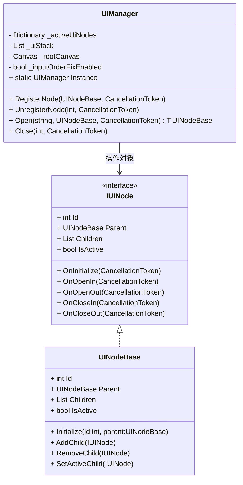
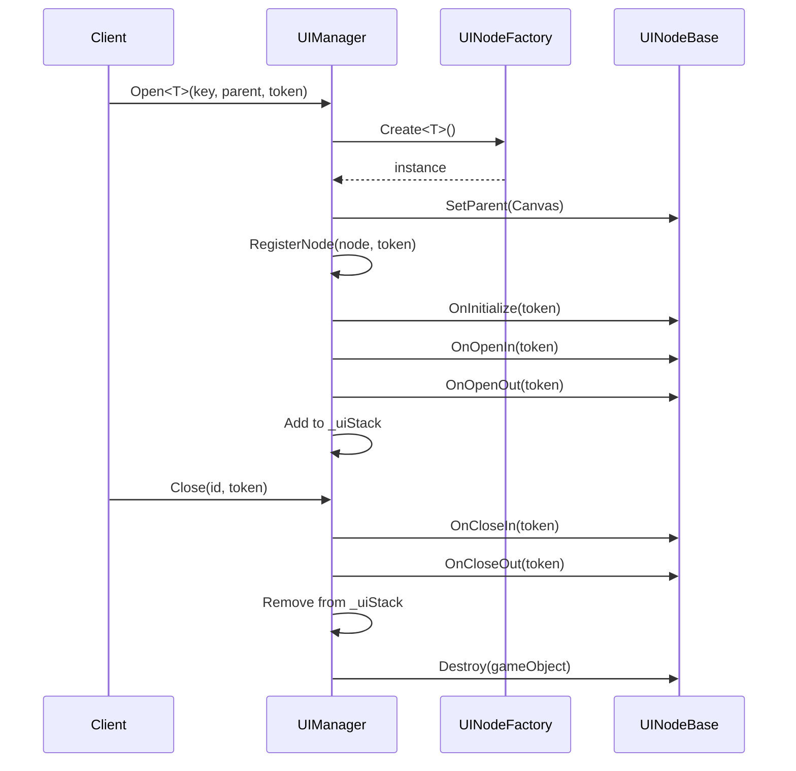

# UIManager

```mermaid
flowchart TD
A[Start] --> B[AwakeでInstance登録]
B --> C[Open(prefabKey)]
C --> D[UINodeFactoryでPrefab生成]
D --> E[TransformをCanvasにSetParent]
E --> F[RegisterNode]
F --> G[PushNode]
G --> H[OnInitialize]
H --> I[OnOpenIn]
I --> J[OnOpenOut]
J --> K[UIStackに追加]
K --> L[入力順序修正]
```





